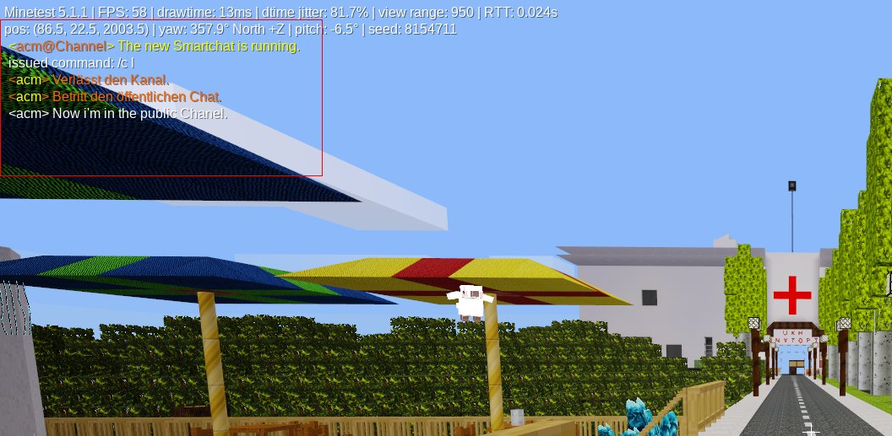

# Smart Chat
A simple chat, which supports chat-channels for minetest.

## Description
Adds the ability to the plain chat, that user can join to channels.
The mod is easy extendable, because you only have to develop a module and
the chat has new commands.
There is a self-growing Helpsystem integrated too.

## Requirements:
Minetest 5.x

## Depends

## optional Depends

## License:
GPL 3.0

## Download
https://github.com/acmgit/smart_chat
